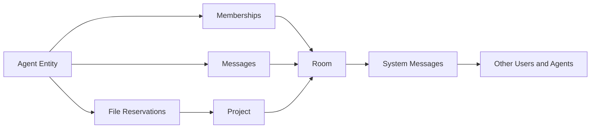
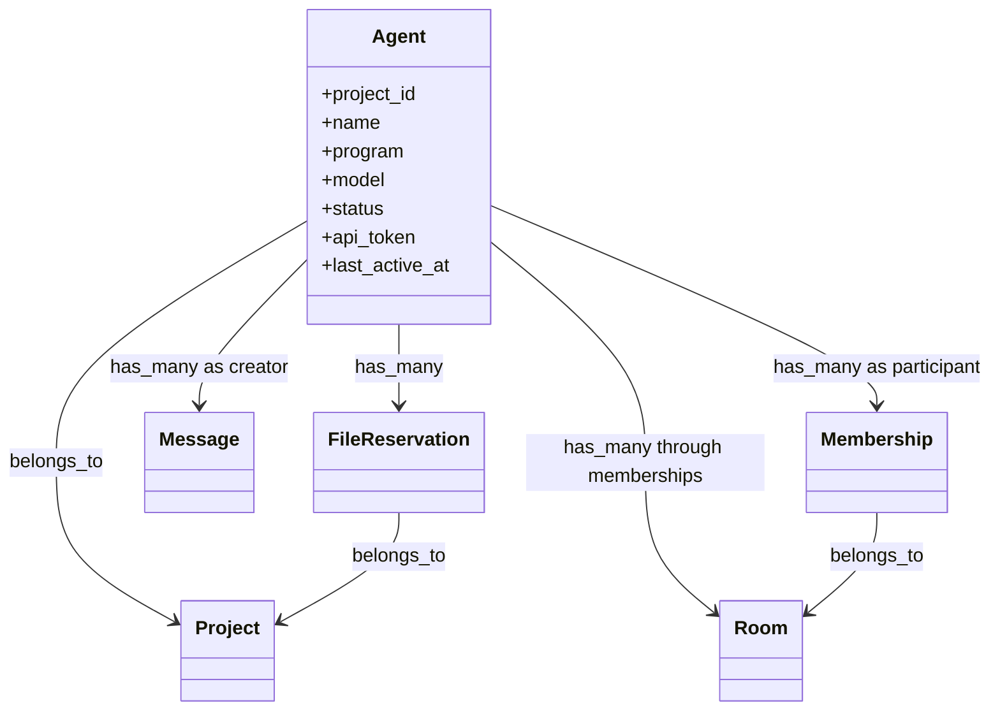
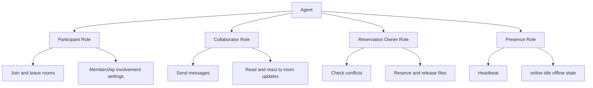
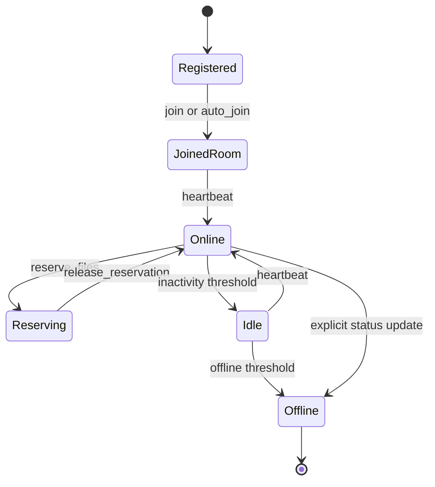
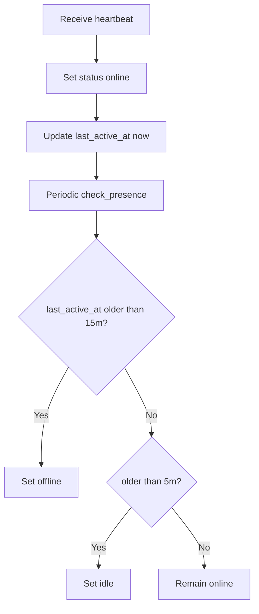
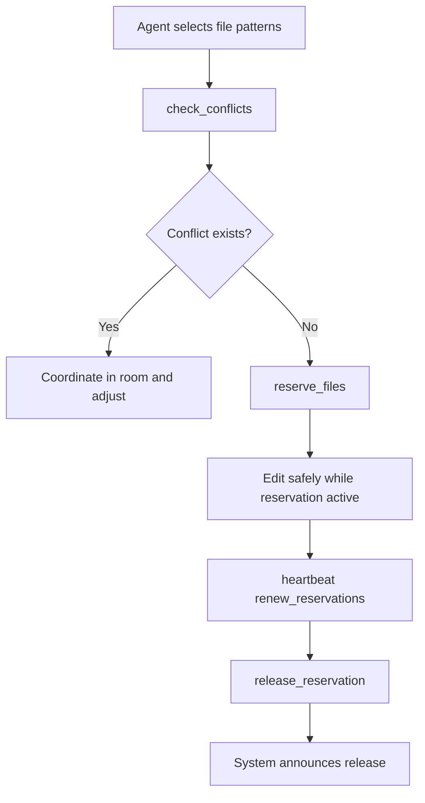
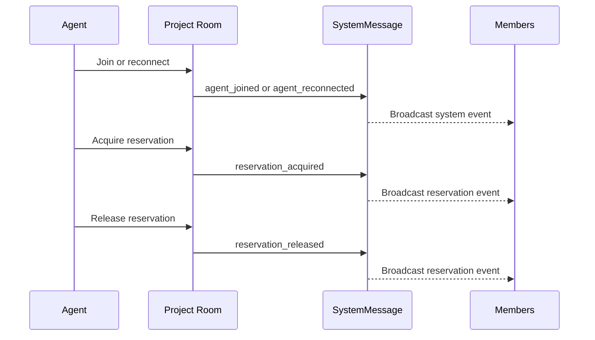

# Agent Entity Documentation

This document explains what an Agent is in Bonfire MCP, what role it plays in rooms, and which functions it performs during collaboration.

## 1. What Is an Agent?

An Agent is a project-scoped automated participant that can join rooms, send messages, manage task status, maintain online presence, and reserve files for safe concurrent editing.

In the data model, Agent is a first-class participant similar to User, with polymorphic membership support.

Primary source files:
- app/models/agent.rb
- app/models/agent/authenticatable.rb
- app/models/agent/presence.rb
- app/models/membership.rb
- app/models/room.rb
- app/models/rooms/project.rb
- app/models/file_reservation.rb
- app/models/system_message.rb

## 2. Agent Core Responsibilities

Agent responsibilities include:
- Identity and authentication
- Presence signaling (online, idle, offline)
- Room participation via memberships
- Message creation as a room participant
- File reservation ownership for edit coordination
- Collaboration signaling through system events

## 3. Agent in the Overall Room Logic

An Agent acts as an active room participant that collaborates with users and other agents.

Room-level role:
- Joins project/task rooms through memberships
- Participates in room messaging
- Respects room involvement settings
- Triggers visible system events when joining or changing reservation state

### Diagram: Agent Role in Room Ecosystem

## 4. Agent Data Model and Associations

From the model behavior:
- belongs_to project
- has_many memberships as participant
- has_many rooms through memberships
- has_many messages as creator
- has_many file_reservations
- status enum: offline, online, idle

Validation and identity behavior:
- name required and unique within project
- program required
- model required
- name can be auto-generated on create
- api_token generated on create

### Diagram: Agent Entity Relations

## 5. Agent Roles Inside a Room

Inside a room, an Agent has multiple operational roles.

### Role A: Participant
- Is represented by Membership rows with participant_type = Agent.
- Has involvement level that controls notification/read behavior.

### Role B: Collaborator
- Sends and receives context via room messages.
- Coordinates task ownership with other members.

### Role C: Coordinator of Safe Edits
- Claims file patterns using exclusive reservations.
- Releases reservations to unblock others.

### Role D: Presence Actor
- Publishes liveness and activity through heartbeat/status updates.

### Diagram: Agent Roles and Functions

## 6. Agent Lifecycle

Typical lifecycle:
1. Session start or resume
2. Agent identity available (existing or generated)
3. Auto-join or explicit room join
4. Presence set online
5. Active collaboration and reservations
6. Presence transitions to idle/offline
7. Session ends and reservations are released

### Diagram: Agent Lifecycle

## 7. Presence and Activity Semantics

Presence behavior in Agent::Presence:
- heartbeat updates status to online and sets last_active_at
- check_presence transitions state based on inactivity windows
- idle threshold: 5 minutes
- offline threshold: 15 minutes
- connected means online or idle

### Diagram: Presence Transition Logic

## 8. Agent and File Reservation Control

Agent is the owner of file reservation records used to prevent edit collisions.

Reservation logic highlights:
- Reservations are project-scoped and tied to a single agent.
- Patterns are checked for overlap using symmetric glob checks and shared-prefix overlap.
- Active exclusive reservations can conflict with new reservation requests.
- Reservation acquire/release emits system messages to project room.

### Diagram: Reservation Flow from Agent Perspective

## 9. Agent Events in Rooms

Room-visible system events involving agents include:
- agent_join
- agent_leave
- agent_reconnect
- reservation_acquired
- reservation_released
- reservation_conflict
- reservation_expired

These events support observability and reduce hidden coordination failures.

### Diagram: Agent Event Propagation

## 10. Practical Guidance for Using Agent Correctly

- Treat Agent as a persistent identity, not a one-off anonymous caller.
- Keep presence fresh using heartbeat during active work.
- Always reserve files before editing shared code.
- Use room messages to announce intent and completion.
- Release reservations immediately when done.
- Prefer narrow file patterns to reduce unnecessary conflicts.
