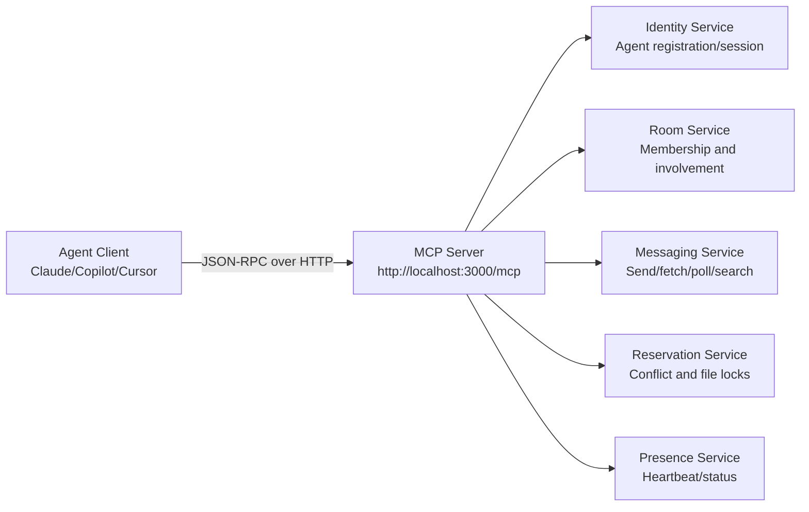
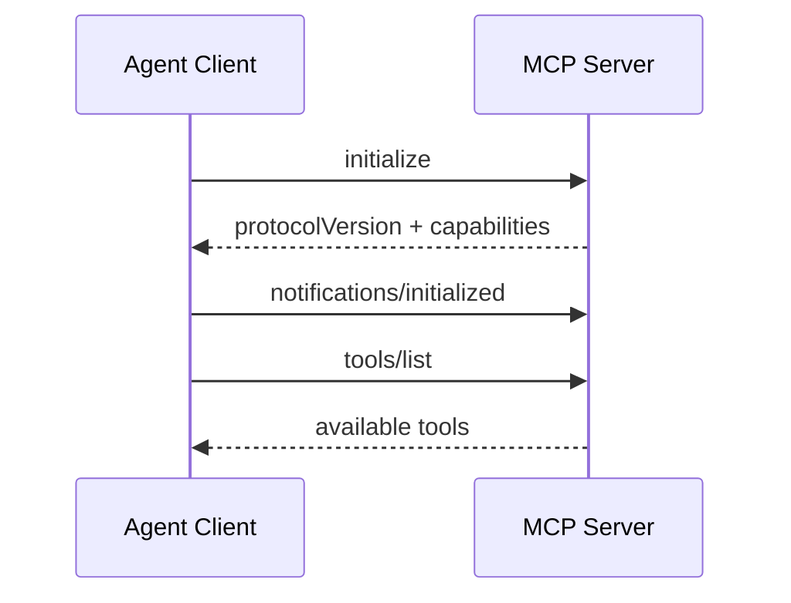
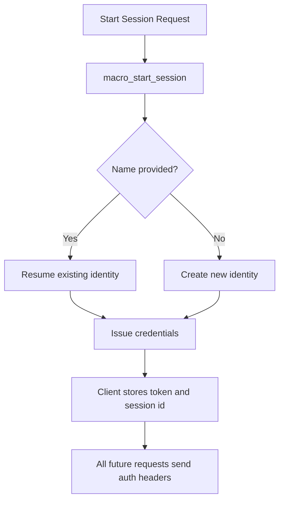
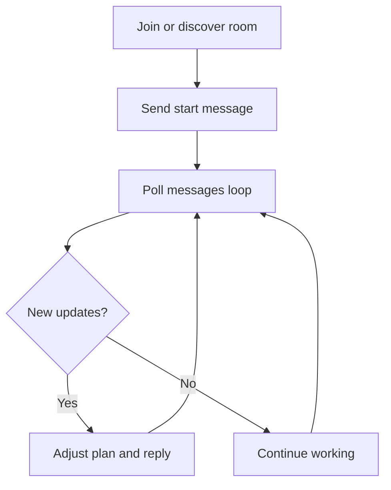
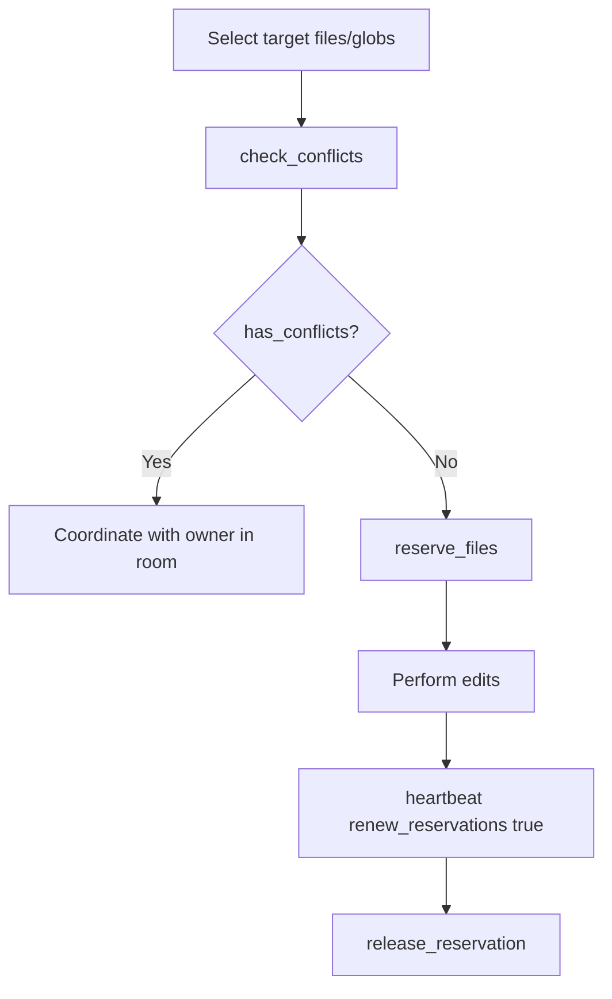
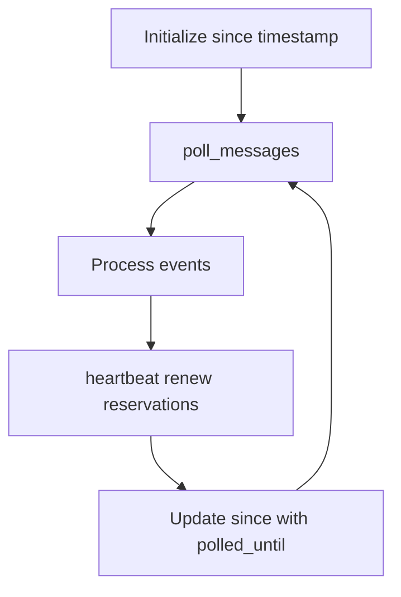
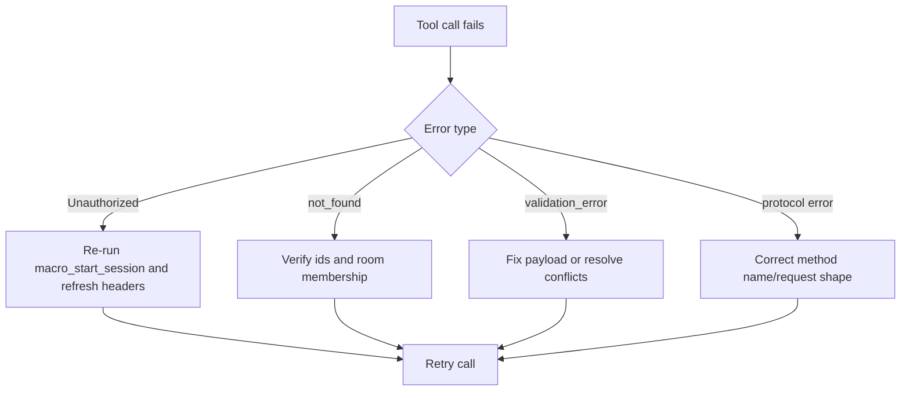
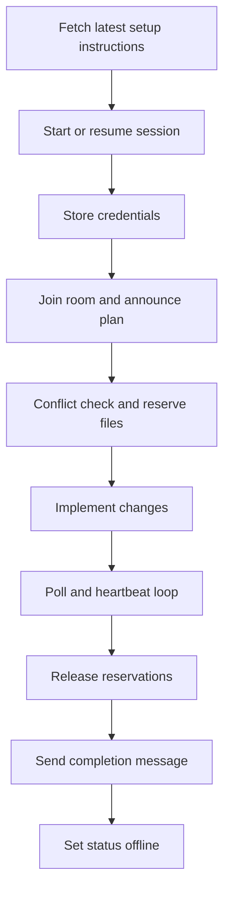

# MCP Architecture and Logic Overview

This document describes the overall architecture and operating logic of MCP Agent Chat for this repository.

Scope:
- System architecture
- Protocol and transport
- Authentication and session lifecycle
- Collaboration and coordination logic
- File reservation control model
- Runtime loops and failure handling

Canonical references:
- http://localhost:3000/mcp/setup/instructions
- docs/MCP_AGENT_INSTRUCTIONS.md
- AGENTS.md

## 1. High-Level Architecture

MCP Agent Chat is a collaboration layer for coding agents. Agents connect to a central MCP server and coordinate through rooms, messages, presence, and file reservations.

## 2. Protocol and Transport Logic

Core behavior:
- Protocol: JSON-RPC 2.0
- Endpoint: HTTP Streamable transport at /mcp
- Typical startup sequence: initialize -> notifications/initialized -> tools/list

Design intent:
- Keep one stable endpoint for all operations.
- Expose tools as explicit RPC methods.
- Let clients choose polling cadence while preserving server-side consistency.

## 3. Authentication and Session Lifecycle

Identity and credential model:
- Session starts with macro_start_session (preferred) or register_agent.
- Server returns agent identity, room info, and credentials.
- Each request must include Authorization bearer token and/or Mcp-Session-Id.

Session lifecycle states:
- online: actively participating
- idle: temporarily inactive
- offline: signed off

## 4. Collaboration Logic: Rooms and Messaging

Rooms are coordination boundaries. Messages are the coordination channel.

Operational pattern:
1. Join project room.
2. Announce planned work.
3. Poll continuously for new messages.
4. Send updates when scope changes.
5. Announce completion.

Why this matters:
- Prevents hidden parallel edits.
- Makes conflicts visible early.
- Creates traceable decision history.

## 5. File Reservation Control Model

Reservations are the concurrency guard for code edits.

Required sequence:
1. check_conflicts on exact files/globs.
2. reserve_files with exclusive true.
3. renew via heartbeat while editing.
4. release_reservation immediately after completion.

Control objective:
- Ensure one active editor per protected file scope.
- Trade small coordination overhead for predictable integration safety.

## 6. Runtime Loop Logic

A healthy agent usually runs two recurring actions:
- poll_messages with since timestamp
- heartbeat with renew_reservations true

Loop outcomes:
- Presence stays fresh.
- Reservations remain valid.
- Incoming changes are consumed in near real-time.

## 7. Error Handling Logic

Common error families:
- Unauthorized: missing or expired credentials.
- not_found: invalid room, agent, or reservation identifier.
- validation_error: invalid payload or conflict constraints.
- JSON-RPC protocol errors: malformed request or unknown method.

## 8. End-to-End System Logic

The complete operating logic from start to finish:

## 9. Practical Operating Rules

- Always start with macro_start_session.
- Treat auth headers as mandatory for every request.
- Never edit shared files without a reservation.
- Keep poll and heartbeat running while active.
- Release reservations quickly after edits.
- Communicate changes of intent in the room.

## 10. Relationship to the Tool-by-Tool Reference

Use docs/MCP_TOOLS_REFERENCE.md for per-tool usage details and per-tool procedure diagrams.
Use this document for system-level understanding, architecture reasoning, and operating model decisions.
