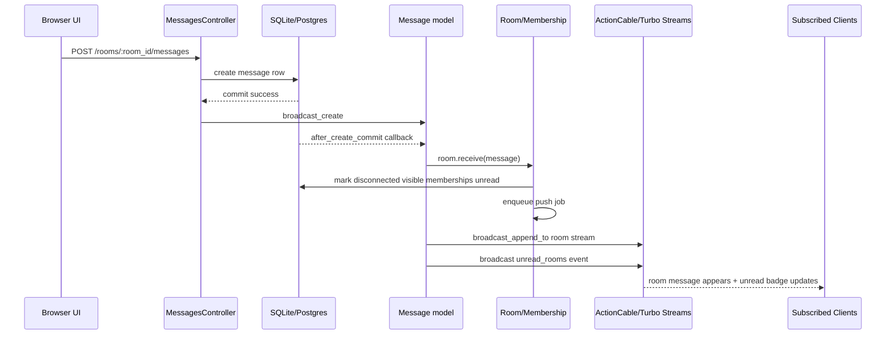

# Messaging Architecture

This document explains how room messaging works in Bonfire, including message persistence, realtime fan-out, Redis usage, and room subscription/presence behavior.

## Executive Summary

- Messages are persisted to the SQL database first.
- Realtime delivery is done after persistence using Turbo Streams and ActionCable.
- Redis is used as an ActionCable transport adapter in production-like environments, not as the primary message store.
- When a user opens a room, the client subscribes to room-specific channels and the server records presence/read state via membership updates.

## Main Components

- `Message` model: message persistence and post-commit callbacks.
- `MessagesController#create`: HTTP entrypoint for human-originated room messages.
- `Mcp::Messaging::SendMessageTool`: MCP entrypoint for agent-originated messages.
- `Message::Broadcasts`: Turbo Stream append/remove and unread event broadcast.
- `Room` + `Membership`: unread state and presence connection state.
- ActionCable channels: room stream, presence, typing, read/unread notifications.

## End-to-End Message Flow

## 1. Message Persistence (Database First)

### Human UI path

When a user sends a message from the web UI:

1. `MessagesController#create` resolves room membership and creates the message.
2. The message is saved to the database.
3. After creation, broadcast logic is triggered.

Code path:

- `app/controllers/messages_controller.rb` (`create`)
- `app/controllers/concerns/room_scoped.rb` (`set_room` membership check)

### MCP agent path

When an AI agent sends a message through MCP:

1. `SendMessageTool` authenticates the agent.
2. It verifies the agent is a member of the target room.
3. It creates a `Message` row in the database.
4. It triggers broadcast logic.

Code path:

- `app/tools/mcp/messaging/send_message_tool.rb`

## 2. What Happens Right After Commit

`Message` has:

- `after_create_commit -> { room.receive(self) }`

This means once DB commit succeeds:

1. `Room#receive` updates unread state for relevant disconnected members.
2. It enqueues async push notifications.

Code path:

- `app/models/message.rb`
- `app/models/room.rb`
- `app/jobs/room/push_message_job.rb`
- `app/models/room/message_pusher.rb`

## 3. Realtime Fan-Out

`Message::Broadcasts#broadcast_create` does two realtime operations:

1. Appends the new message to the room Turbo Stream target.
2. Broadcasts a lightweight `unread_rooms` event for sidebar unread indicators.

Code path:

- `app/models/message/broadcasts.rb`
- Room page subscription in `app/views/rooms/show.html.erb` via `turbo_stream_from @room, :messages`

## 4. Redis vs Database

### Is message data stored in Redis?

No. Message records are stored in the app database.

### Where does Redis fit?

Redis is an ActionCable pub/sub transport adapter in environments configured to use it.

From `config/cable.yml`:

- `development`: `adapter: async` (in-process adapter)
- `production` and `performance`: Redis adapter

So in production topology:

- App process broadcasts via ActionCable.
- ActionCable uses Redis pub/sub to distribute events across app instances.
- Connected websocket clients receive events.

Redis here is distribution infrastructure, not authoritative chat storage.

## 5. What Happens When a User Opens/Joins a Room

There are two related concepts:

- Membership in a room (authorization/data model)
- Live subscription to room events (websocket runtime)

### Authorization before subscribing

`RoomChannel#subscribed` calls `find_room` scoped to `current_user.rooms`.
If not found, subscription is rejected.

Code path:

- `app/channels/room_channel.rb`

### Presence registration

`PresenceChannel` (inherits `RoomChannel`) does:

- `on_subscribe :present`
- `on_unsubscribe :absent`

`present` marks membership connected and broadcasts a per-user read event.
`refresh` updates liveness periodically.

Code path:

- `app/channels/presence_channel.rb`
- `app/models/membership/connectable.rb`
- `app/javascript/controllers/presence_controller.js`

### Read/unread notification channels

- `ReadRoomsChannel` streams `user_<id>_reads`
- `UnreadRoomsChannel` streams global `unread_rooms`

Front-end controllers subscribe and update sidebar state.

Code path:

- `app/channels/read_rooms_channel.rb`
- `app/channels/unread_rooms_channel.rb`
- `app/javascript/controllers/read_rooms_controller.js`
- `app/javascript/controllers/rooms_list_controller.js`

### Typing notifications

`TypingNotificationsChannel` is room-scoped and broadcasts `start`/`stop` typing events to subscribers.

Code path:

- `app/channels/typing_notifications_channel.rb`
- `app/javascript/controllers/typing_notifications_controller.js`

## 6. Practical Answer to Your Questions

- If multiple users open one room and one user sends a message, all subscribed clients in that room receive the new message in realtime.
- The message is first saved in the SQL database, then broadcast.
- Redis is used only for ActionCable event distribution when the Redis adapter is active.
- Opening a room causes websocket subscriptions; presence channel callbacks update connection/read state on the server side.

## 7. Current Important Implementation Note

`ApplicationCable::Connection` currently sets `current_user` to the human overseer in `connect`.
This is useful in current local setup, but in a multi-user production auth model you would typically identify the real signed-in user per websocket connection.

Code path:

- `app/channels/application_cable/connection.rb`
