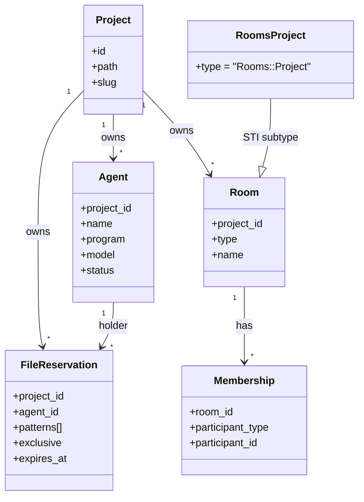
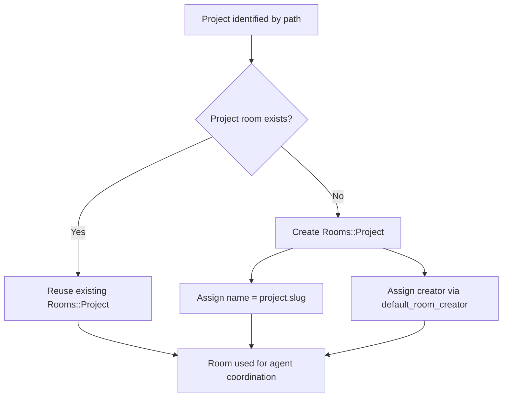
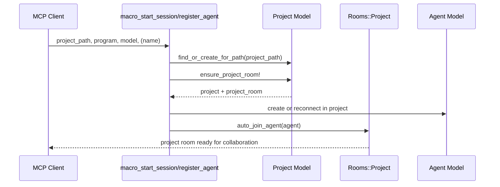

# Project Entity Documentation

This document explains the `Project` entity in Bonfire MCP: what it represents, how it is created, and how it relates to rooms, agents, and file reservations.

## 1. What Is a Project?

A `Project` is the workspace-level boundary for MCP collaboration.

It represents a single repository path and owns:
- all registered agents for that path
- all rooms created for that path
- all file reservations used for edit coordination in that path

In practical terms, agents do not collaborate globally. They collaborate inside one project, identified by its filesystem path.

Primary source files:
- `app/models/project.rb`
- `app/models/rooms/project.rb`
- `app/models/room.rb`
- `app/models/agent.rb`
- `app/models/file_reservation.rb`
- `app/tools/mcp/workflow/macro_start_session_tool.rb`
- `app/tools/mcp/identity/register_agent_tool.rb`

## 2. Core Data Model

`Project` fields (from schema):
- `id`
- `path` (required, unique)
- `slug` (required, unique, lowercase alphanumeric + dashes)
- `created_at`, `updated_at`

Validation/invariants:
- `path` must be present and unique.
- `slug` must be present, unique, and match `/\A[a-z0-9\-]+\z/`.
- On create, if slug is blank, it is generated from `File.basename(path).parameterize`.

## 3. Associations and Ownership

The `Project` entity is a root aggregate for collaboration records:
- `has_many :agents, dependent: :destroy`
- `has_many :rooms, dependent: :destroy`
- `has_many :file_reservations, dependent: :destroy`

This means deleting a project removes its MCP participants, room graph, and reservations.

### Diagram: Project-Centric Relationship Map

## 4. Project Room Invariant

Every project is expected to have exactly one project room (`Rooms::Project`).

Key methods:
- `project_room`: fetches the room with `type: "Rooms::Project"`.
- `ensure_project_room!`: creates one if missing.

`Rooms::Project` enforces uniqueness with:
- `validates :project_id, uniqueness: { message: "already has a project room" }`

Why this matters:
- Reservation conflict and acquire/release events are broadcast to the project room.
- Agent onboarding auto-joins this room.
- It acts as the canonical shared channel for project-scoped MCP activity.

### Diagram: Ensuring a Single Project Room

## 5. Lifecycle in MCP Session Start

`Project` creation and reuse are integrated into session bootstrap tools:
- `macro_start_session`
- `register_agent`

Both call:
1. `Project.find_or_create_for_path(project_path)`
2. `project.ensure_project_room!`

Then they register/reconnect an agent under that project and join the project room.

### Diagram: Session Bootstrap Around Project

## 6. Project and Reservation Coordination

Reservations are project-scoped (`belongs_to :project`).

Conflict checks run inside the same project boundary:
- active + exclusive reservations are queried from `project.file_reservations`
- overlap is evaluated with glob and prefix logic
- conflict/acquired/released system events target `project.project_room`

Implication:
- Two agents in different projects never conflict, even with identical file patterns.

## 7. System Events Triggered by Project Context

`Project` context drives event routing:
- On project creation: `SystemMessage.project_created(project: self)` posted to meta room.
- On reservation changes: events are posted to the project room.
- On room creation: room metadata includes project relationship where applicable.

## 8. Practical Rules

Use these rules when touching project logic:
- Always resolve project by path before agent operations.
- Ensure project room existence before any room-scoped announcements.
- Keep reservation logic project-scoped; do not query globally.
- Preserve unique `project.path` and unique `project.slug` guarantees.
- Treat `Project` as the ownership boundary for MCP collaboration state.

## 9. Quick Reference

- Entity: `Project`
- Natural key: `path`
- Friendly key: `slug`
- Scope boundary for: agents, rooms, reservations
- Canonical channel: one `Rooms::Project` per project
- Entry points: `macro_start_session`, `register_agent`
